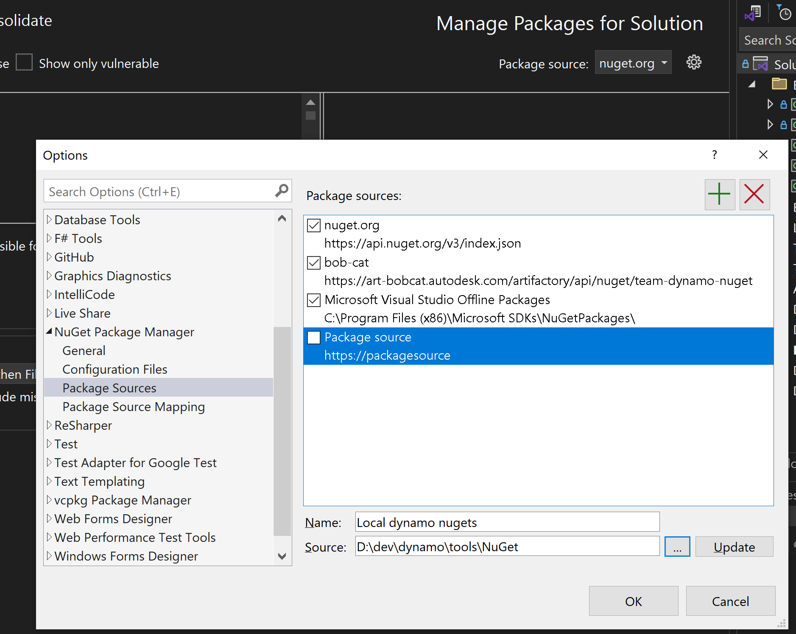

# Dynamo for Revit

**Dynamo for Revit** is a plugin for Revit and a library of [Dynamo](https://github.com/DynamoDS/Dynamo) nodes. It is also commonly referred to as **DynamoRevit** or **D4R**.

**Dynamo for Revit** maintains separate branches for different Revit versions. For example, to run **Dynamo for Revit** on Revit 2016, use the **Dynamo for Revit** 2016 branch.

## How to build and use DynamoRevit

To use a locally built DynamoRevit plugin within Revit, complete the following steps:

1. [Prerequisites](#prerequisites)
2. [Build DynamoRevit](#1-build-dynamorevit)
3. [Get or Build Dynamo Core](#2-get-or-build-dynamo-core)
4. [Associate DynamoRevit with DynamoCore](#3-associate-dynamorevit-with-dynamo-core)
5. [Create a Revit Addin](#4-create-a-revit-addin)

### Prerequisites

Ensure the following software is installed on your system:

- **Revit**: Revit 2026 (.NET 8), Revit 2027 or later (.NET 10)
- **Visual Studio**: Visual Studio 2022 (17.8.0 or newer)
- **.NET SDK**: [.NET 8 SDK](https://dotnet.microsoft.com/en-us/download/dotnet/8.0) for Windows x64
- **.NET SDK**: [.NET 10 SDK](https://dotnet.microsoft.com/en-us/download/dotnet/10.0) for Windows x64

### 1. Build DynamoRevit

- Clone the DynamoRevit repository:

  > `git clone https://github.com/DynamoDS/DynamoRevit.git`

- Check out the branch corresponding to your target Revit version:

  - For the latest Revit release: `git checkout master`
  - For older Revit releases: `git checkout Revit2026`

- Open `DynamoRevit.All.sln` in Visual Studio and select a build configuration:

  - Configuration: `Debug` or `Release`
  - Platform: `NET80` (or `NET100` for Revit 2027 and later)

- (Optional) Set the `RevitVersionNumber` environment variable to the Revit version you're building against (e.g., `2025`, `2026`, `2027`). If not set, it defaults to `"Preview Release"`.

- If Revit is not installed locally or you need to use a specific version, copy `RevitAPI.dll` & `RevitAPIUI.dll` to the appropriate folder based on your build platform. These DLLs are located in the same folder as `Revit.exe` on your computer:

  - `DynamoRevit\lib\Revit Preview Release\net8.0` (for NET80 builds), OR
  - `DynamoRevit\lib\Revit Preview Release\net10.0` (for NET100 builds)

  - If you want to build other branches of DynamoRevit but the corresponding version of Revit is not installed locally, you can get these DLLs from [NuGet](https://www.nuget.org/).

  > **Revit API DLL Lookup Order**
  >
  > The build process automatically locates Revit API DLLs in the following order:
  >
  > 1. Custom `REVITAPI` paths defined in `src/Config/user_local.props` (highest priority if set)
  > 2. `$(SolutionDir)..\lib\Revit $(RevitVersionNumber)\net8.0` (or `net10.0`)
  > 3. `C:\Program Files\Autodesk\Revit Architecture $(RevitVersionNumber)`
  > 4. `C:\Program Files\Autodesk\Revit $(RevitVersionNumber)`
  > 5. `C:\Program Files\Autodesk\Revit Preview Release`

- Build `DynamoRevit` solution to produce the right version of `DynamoRevitDS.dll` (i.e. `4.0.0.xxxx` in this case).

### 2. Get or Build Dynamo Core

Building both DynamoRevit and DynamoCore from source is often beneficial for development. To build from source:

- Clone Dynamo Core from https://github.com/dynamods/dynamo
- Check out the branch for your target Dynamo version. For the latest Revit release or preview releases, use the `master` branch. For release candidate testing, select the appropriate branch (e.g., `RC4.0.0_master`).
- Build Dynamo following the instructions in the [README](https://github.com/DynamoDS/Dynamo/blob/master/README.md).

Alternatively, you can use the prebuilt Dynamo that ships with Revit or retrieve a specific Dynamo Core version from NuGet without building from source. Documentation for these approaches is pending.

### 3. Associate DynamoRevit with Dynamo Core

After building DynamoRevit, a `Dynamo.config` file will be generated at `DynamoRevit\bin\NET100\Debug\Dynamo.config` (or `Release`). This configuration file specifies which DynamoCore installation to use with your DynamoRevit build.

For example, the following configuration:

```xml
<?xml version="1.0" encoding="utf-8"?>
<configuration>
  <appSettings>
     <add key="DynamoRuntime" value="C:\my\repos\Dynamo\bin\AnyCPU\Debug"/>
  </appSettings>
</configuration>
```

will configure DynamoRevit to use the DynamoCore located at `C:\my\repos\Dynamo\bin\AnyCPU\Debug`. This configuration is particularly useful for testing DynamoRevit with different DynamoCore versions or when using the Revit Test Framework (RTF) with a custom build. Note that rebuilding will overwrite this file, requiring you to update the path after each build.

### 4. Create a Revit Addin

Beginning with Revit 2020, DynamoCore and the DynamoRevit addin are included in the Revit installation folder. For development purposes, first remove or delete the DynamoForRevit addin folder from: `%ProgramFiles%\Autodesk\Revit 2026\AddIns`.

For development, you must manually create an addin file that instructs Revit to load your custom plugin on startup. A `DynamoForRevit.addin` file should be structured as follows:

```xml
<?xml version="1.0" encoding="utf-8" standalone="no"?>
<RevitAddIns>
  <AddIn Type="Application">
    <Name>Dynamo For Revit</Name>
    <Assembly>"C:\my\repos\DynamoRevit\bin\NET100\Debug\Revit\DynamoRevitDS.dll"</Assembly>
    <AddInId>8D83C886-B739-4ACD-A9DB-1BC78F315B2B</AddInId>
    <FullClassName>Dynamo.Applications.DynamoRevitApp</FullClassName>
    <VendorId>ADSK</VendorId>
    <VendorDescription>Dynamo</VendorDescription>
  </AddIn>
</RevitAddIns>
```

Place this `DynamoForRevit.addin` file in the following location:

- `%AppData%\Autodesk\Revit\Addins\<version>`

where `<version>` corresponds to your target Revit version. Note that the `Assembly` tag must point to the output folder of the **Dynamo for Revit** build created in step 1.

After completing these steps, launch Revit to verify that the Dynamo and Dynamo Player icons appear on the Manage tab. If you encounter issues, refer to the troubleshooting section below.

### Build dynamo revit against a local version of Dynamo

1. Build Dynamo locally
2. Run the Dynamo nuget script (more info [here](https://github.com/DynamoDS/Dynamo/blob/master/tools/NuGet/README.md))
```.\BuildPackages.bat "template-nuget" "...\GitHub\Dynamo\bin\AnyCPU\Release"```
This will locally produce all the dynamo nugets.
3. In you Visual Studio editor, add/change the nuget sources to point to your local nuget folder (where the local nugets are).


## Troubleshooting Build Issues

* If you see errors like: 
   
   ```1>  "C:\Program Files (x86)\Common Files\microsoft shared\TextTemplating\11.0\TextTransform.exe" -out AssemblySharedInfo.cs AssemblySharedInfo.tt
   1>c:\Users\bykovsm\AppData\Local\Temp\AssemblySharedInfo.tt(1,1): error CS1519: Compiling transformation: Invalid token 'this' in class, struct, or interface member declaration
   1>c:\Users\bykovsm\AppData\Local\Temp\AssemblySharedInfo.tt(1,6): error CS1520: Compiling transformation: Method must have a return type
   ```  	
   then you need to get rid of any white space in the last line of *DynamoRevit/src/AssemblyInfoGenerator/transform_all.tt*. It's also possible that *transform_all.bat* is looking for a text templating engine for a version of visual studio you do not have installed.

* If you see missing classes or namespaces from the Revit or Dynamo APIs, look at the environment variable values in [CS.props](https://github.com/DynamoDS/DynamoRevit/blob/Revit2017/src/Config/CS.props). These environment variables can be overwritten by providing correct path for Dynamo and Revit libraries in [user_locals.props](https://github.com/DynamoDS/DynamoRevit/blob/Revit2017/src/Config/user_local.props)

* If your addin is not appearing in Revit, try removing any old copies of the Dynamo.addin file from these locations:
   -  `Users/<user>/AppData/Roaming/Autodesk/Revit/Addins/<version>`
   -  `ProgramFiles/Autodesk/Revit <version>/AddIns`

* Revit 2020 and later do not use the DynamoVersionSelector by default, but it's still in the DynamoRevit build. If you'd like to try using it, you can create a Dynamo.addin file that looks like this:

```xml
<?xml version="1.0" encoding="utf-8" standalone="no"?>
<RevitAddIns>
  <AddIn Type="Application">
    <Name>Dynamo For Revit</Name>
    <Assembly>"E:\MyGitPath\Dynamo\bin\AnyCPU\Debug\Revit_xxxx\DynamoRevitVersionSelector.dll"</Assembly>
    <AddInId>8D83C886-B739-4ACD-A9DB-1BC78F315B2B</AddInId>
    <FullClassName>Dynamo.Applications.VersionLoader</FullClassName>
    <VendorId>ADSK</VendorId>
    <VendorDescription>Dynamo</VendorDescription>
  </AddIn>
</RevitAddIns>
```

## Running DynamoRevit Tests with RevitTestFramework

(This documentation is a work in progress, still being assembled and verified from internal documents)
For more information, see https://github.com/DynamoDS/RevitTestFramework/blob/master/README.md

### Option 1: RevitTestFrameworkConsole.exe

A console application which allows running RTF without a user interface. If you'd like to learn more about the command line options for RTF, you can simply type "RevitTestFrameworkConsole -h".

As an example, the following command:

```RevitTestFrameworkConsole.exe --dir [DynamoRevit dev root]\test\System -a [DynamoRevit dev root]\bin\AnyCPU\Debug\Revit\RevitSystemTests.dll -r MyTestResults.xml -revit:"C:\Program Files\Autodesk\Revit 2019\Revit.exe" --copyAddins --continuous```

will execute all tests in MyTest.dll located in C:\MyTestDir and place all results in MyTestResults.xml (in the same folder). It will use Revit 2019 as specified and will run all tests without shutting down Revit.

If you use dev package, another example:

```RevitTestFrameworkConsole.exe --dir [DynamoRevit dev root]\test\System -a [DynamoRevit dev root]\bin\AnyCPU\Debug\Revit\RevitSystemTests.dll -r MyTestResults.xml -revit:"D:\Revit\Revit.exe" --continuous```

You specified a non-normally installed Revit.exe, you do not need to add the '--copyAddins' parameter. You need to manually copy a Dynamo.addin file to your working directory 'C:\MyTestDir'.

### Option 2: RevitTestFrameworkGUI.exe (This only supports Revit install build)

Provides a visual interface for you to choose tests from a treeview and to visualize the results of the tests as they are run. The same settings provided in the command line argument help above are available in the UI. The UI also allows you to save your testing session.

The input fields to set the test assembly, the working directory, and the results file, as well as the tree view where available tests are displayed, support dragging and dropping of files and folders.

- *Test Assembly* is your dll to test. 
- *Working Directory* is the folder contains your test Revit file and dyn file like Empty.rvt and D4RCreateWallSystemTests.dyn.
- *Additional Resolution Directories* are the DynamoCore and DynamoRevit locations you want to use to run the test (Do they need to match what's in the Dynamo.addin file?)
- *Revit 2020* you can choose which Revit version you want to use in this DropDown List. (Only installed versions of Revit.)

