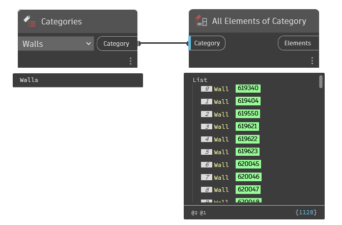

## In Depth
`Categories` contains a drop-down menu with every category and subcategory available in the current document (file). In the example below, all instances of walls in the current document are being collected.
___
## Example File

