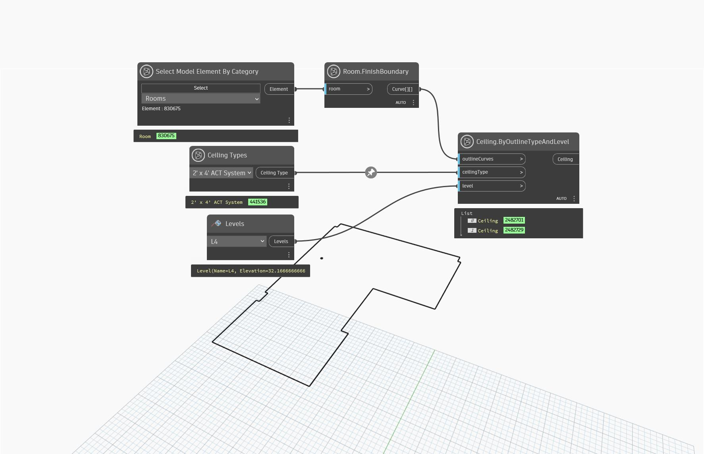

## In Depth
`Ceiling Types` allows a selection of a single Ceiling type from all the ceiling types available in the current document (file). 

In the example below, the `Ceiling Types` node is utilized with the `Ceiling.ByOutlineTypeAndLevel` and `Room.FinishBoundary` nodes to create a simple ceiling from a room's boundaries.
___
## Example File

