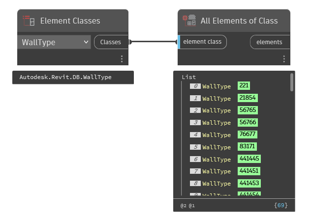

## In Depth
`Element Classes` provides access to all element subclasses (options) in Revit. This node is formerly know as "Element Types". `Element Classes` represents every object in Revit.

In the example below, all Wall Types are being collected from the current document (file).
___
## Example File

