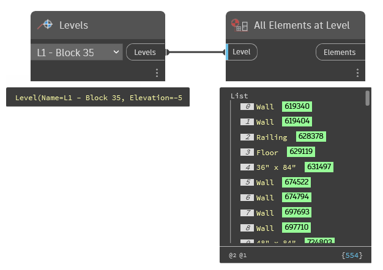

## In Depth
`All Elements at Level` collects all instances of all elements that have dependencies on the given level. 

A couple of examples of a dependency are: 
- A wall that is attached to that level
- A roof that is hosted to that level

In the example below, all elements for L1 - Block 35 are being returned.
___
## Example File

