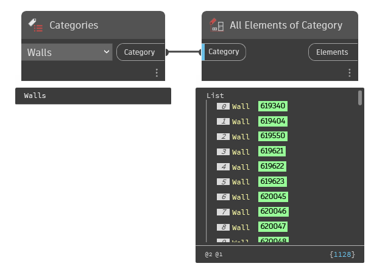

## In Depth
Use in conjuction with either the categories dropdown selection node or Category.ByName node to collect all instances of a given category in the current document (file).
___
## Example File

