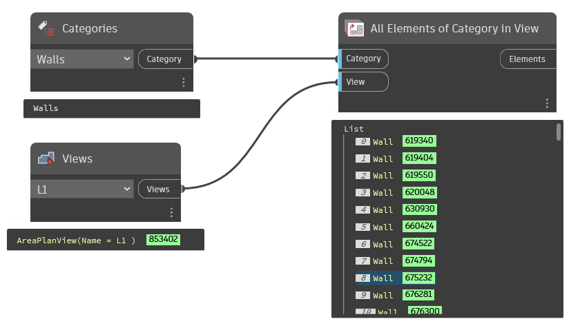

## In Depth
Use in conjuction with a category selection node* and a view input node** to collect all instances of elements of a given category in the current document (file).

* You can use the categories drop-down or a Category.ByName node.
** Obtain a view through a dropdown or an active view node.
___
## Example File

