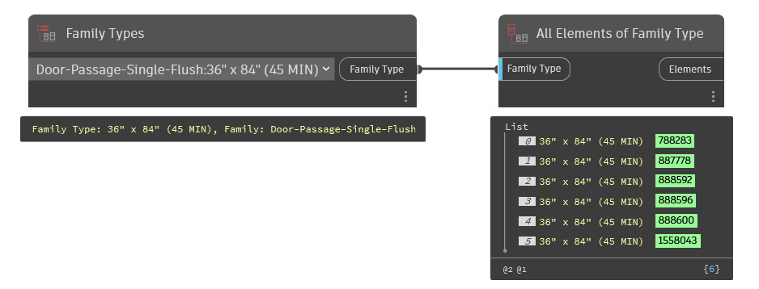

## In Depth
`All Elements of Family Type` collects all instances of a given family type in the current document (file). For reference, family types are loadable pieces of content from a ".rfa" file type.

In the example below, all family instances of the selected Family Type are being collected from the current document (file).
___
## Example File

