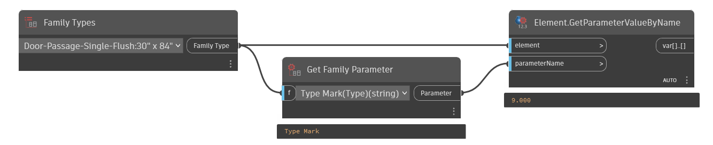

## In Depth
Given a Family Instance or Type allows the user to select a parameter as a string. This provides the parameter name for further use in obtaining the value or setting the value.
___
## Example File

