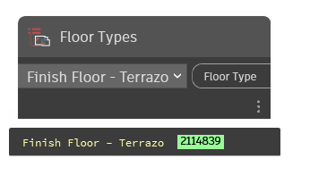

## In Depth
`Floor Types` contains a drop-down menu with every floor type available in the current document (file). For reference, floor types are system families that are created in Revit via duplicate.

In the example below, the `Floor Types` node is utilized with the `Floor.ByOutlineTypeAndLevel` and `Room.FinishBoundary` nodes to create a simple floor from a room's boundaries.
___
## Example File

