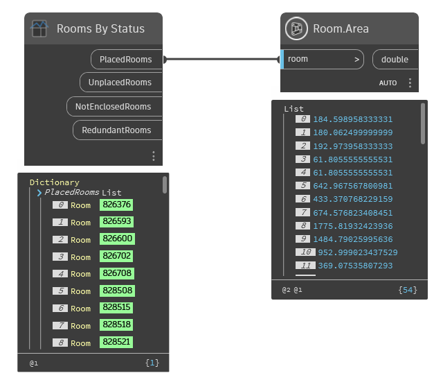

## In Depth
Returns all rooms in the document grouped by status. Status includes rooms that are:
- Placed and bounded properly
- Unplaced (previously deleted from a view, but not from the model)
- Not Enclosed (unbounded rooms with no calculated area)
- Redundant Rooms (Rooms that share an enclosed space with other rooms)
___
## Example File

