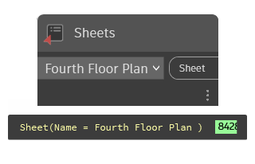

## In Depth
`Sheets` allows a selection of a single sheet from all the sheets available in the current document (file). `Sheets` includes all sheets sorted by their sheet name parameter.

In the example below, the placed viewports are collected from the selected sheet.

___
## Example File

