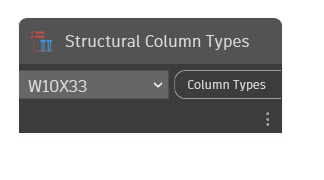

## In Depth
"Structural Column Types" contains a drop-down menu with every structural column type available in the current document (file). Structural column types are loadable families from .rfa files.
___
## Example File

