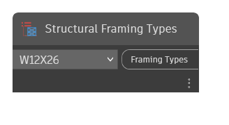

## In Depth
`Structural Framing Types` contains a drop-down menu with every structural framing type available in the current document (file). Structural framing types are loadable families from .rfa files.

In the example below, a structural framing instance is created in the current document given the structural framing type, location curve, and level reference.
___
## Example File

