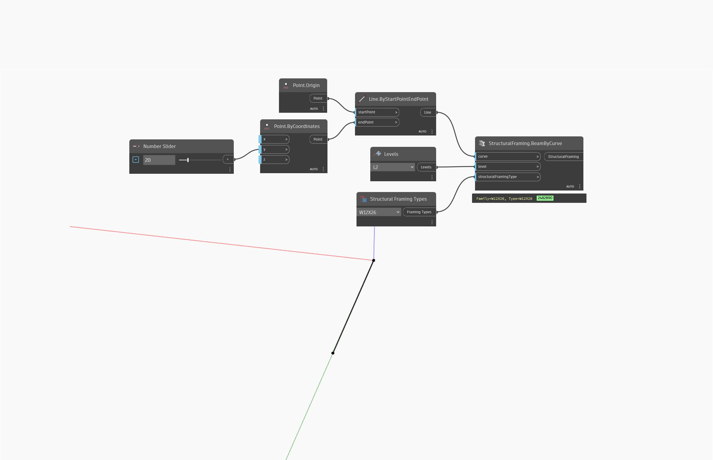

## In Depth
"Structural Framing Types" contains a drop-down menu with every structural framing type available in the current document (file). Structural framing types are loadable families from .rfa files.
___
## Example File

