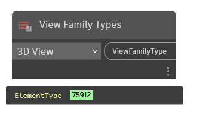

## In Depth
"View Family Types" contains a drop-down menu with every view family type available in the current document (file). View family types are element types in Revit and are used to create any view instance based on the type.
___
## Example File

