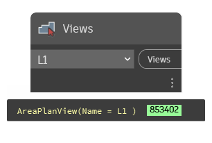

## In Depth
The views dropdown provides an alphabetical selection of all view elements in the current document (file). This includes view templates, sheets, schedules, legends, 3d views and internal view elements.
___
## Example File

