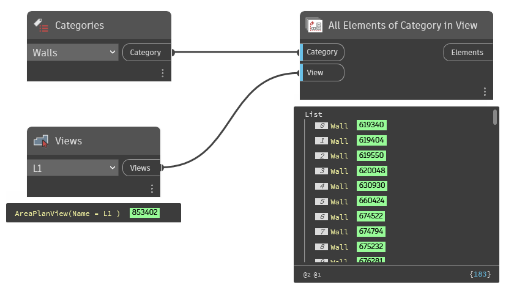

## In Depth
`Views` provides an alphabetical selection of all view elements in the current document (file). This includes view templates, sheets, schedules, legends, 3d views and internal view elements.

In the example below, the selected view is used to collect all wall elements in that view.
___
## Example File

