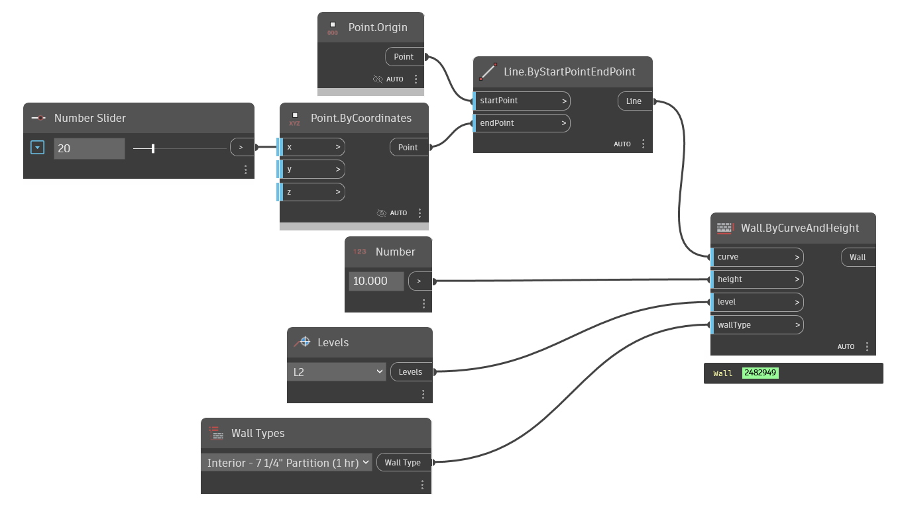

## In Depth
Allows a selection of a single wall type from all the wall types available in the current document (file). This node is useful with the Wall.ByCurveAndHeight and Wall.ByCurveAndLevels nodes.
___
## Example File

