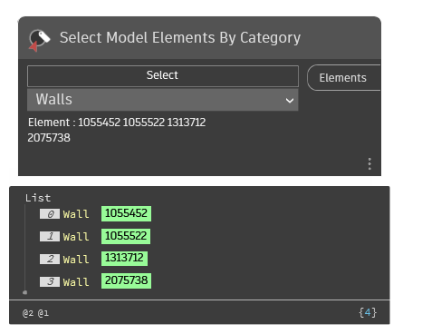

## In Depth
Provides a pick selection for a multiple elements of the selected category from the current document (file). This node provides a filtered selection based on the selected category (from all avaiable subcategories) in the current document.
___
## Example File

