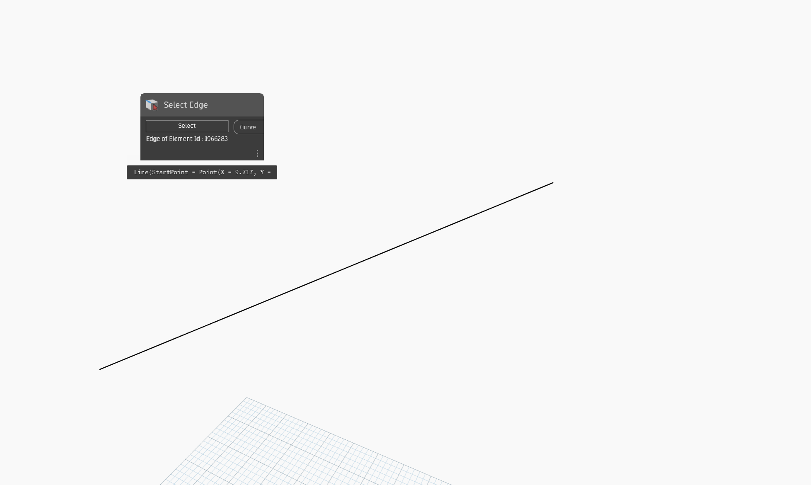

## In Depth

`Select Edge` displays a cursor in Revit that allows you to select a single edge. The object returned is a curve or line that represents the selected edge. Additionally, `Select Edge` reports the owning element id of the edge that is selected.

In the example below, a line is returned that represents the top edge of a parapet in the current document (file).

___
## Example File

