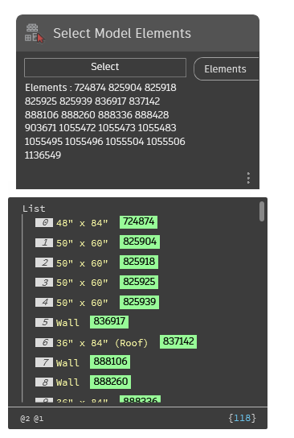

## In Depth
`Select Model Elements` provides a crossing window selection for multiple elements from the current document (file). 

Selecting from right to left will select all objects that intersect the selection box. Selecting from left to right will select all objects that are fully enclosed in the selection box.

In the example below, a variety of elements are selected from the current view.
___
## Example File

