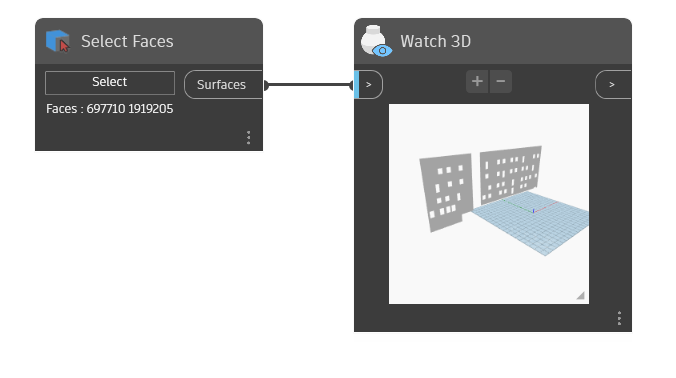

## In Depth
`Select Faces` is a user interface node that provides selection of multiple faces in the current Revit document.

In the example below, two wall faces are selected in Revit and the corresponding surface geometries are returned. Additionally, `Select Faces` reports the owning element ids of the faces that are selected.
___
## Example File

