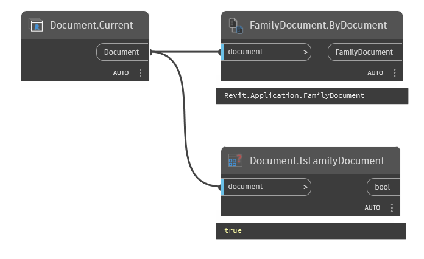

## In Depth
`Document.IsFamilyDocument` reports whether the input Revit document is a family document. `Document.IsFamilyDocument` is useful in conjunction with `FamilyDocument.ByDocument`.

In the example below, the active Revit file's document is collected and checked to see if it is a family document.
___
## Example File

