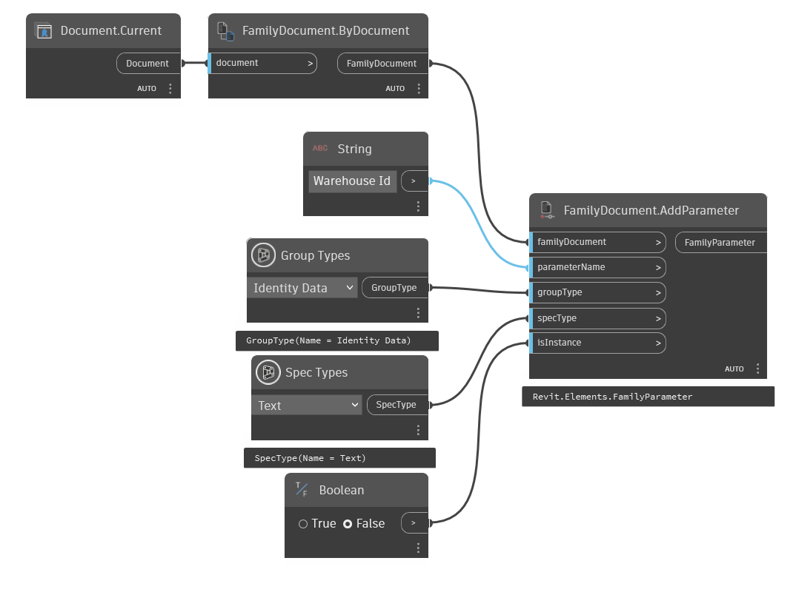

## In Depth
`FamilyDocument.AddParameter` adds a new parameter to the family document with a given name, group type and unit type.

In the example below, a new parameter called, "Warehouse Id" that stores text values is created.
___
## Example File

