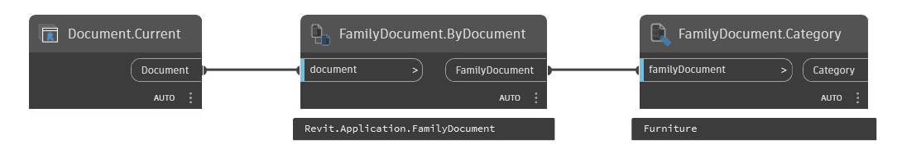

## In Depth
`FamilyDocument.Category` obtains the Revit category that the given family document is assigned to.

In the example below, the current Revit document is converted to a family document and the Revit category is obtained.
___
## Example File

