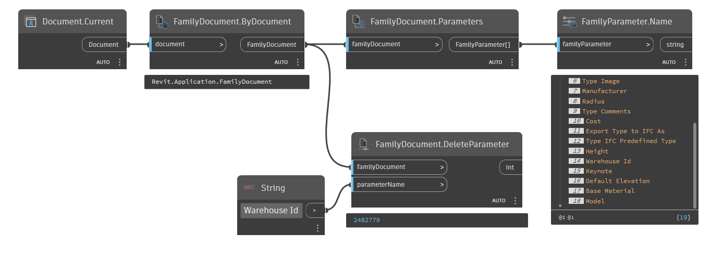

## In Depth
`FamilyDocument.DeleteParameter` removes an existing, user-created parameter in the given family document with a given name. If succesful, the element id of the deleted parameter is returned.

In the example below, an existing parameter called, "Warehouse Id" is removed from the family document.
___
## Example File

