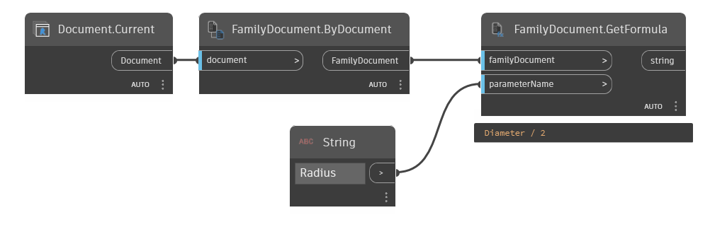

## In Depth
`FamilyDocument.GetFormula` obtains the formula assigned to the input parameter, found by name, if available.

In the example below, the current file is converted to a family document and the formula assigned to a parameter named "Radius" is retrieved.
___
## Example File

