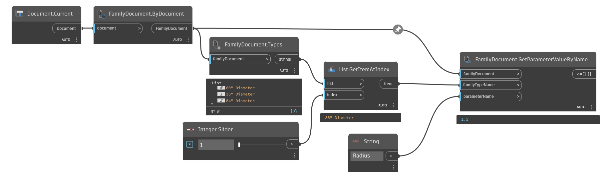

## In Depth
`FamilyDocument.GetParameterValueByName` obtains the given parameter value for the given family type in the family document.

In the example below, the current file is converted to a family document. The value of the parameter, "Radius" is then obtained for the "36" Diameter" family type.
___
## Example File

