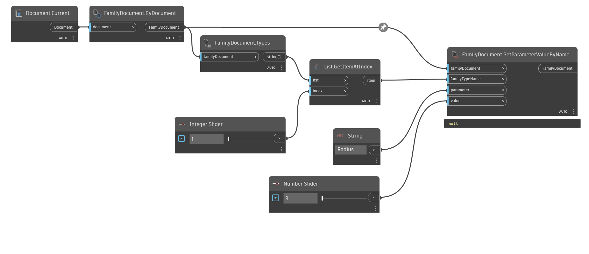
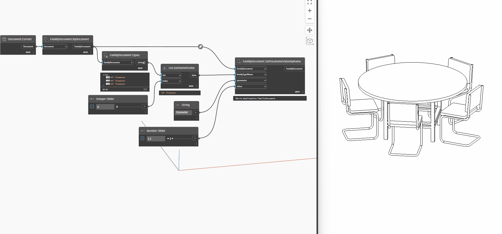

## In Depth
`FamilyDocument.SetParameterValueByName` sets the given parameter to the given value for the selected family type in the family document.

In the example below, the current file is converted to a family document. The value of the parameter, "Radius" is then set to the `Number Slider` value for the "36" Diameter" family type.
___
## Example File

