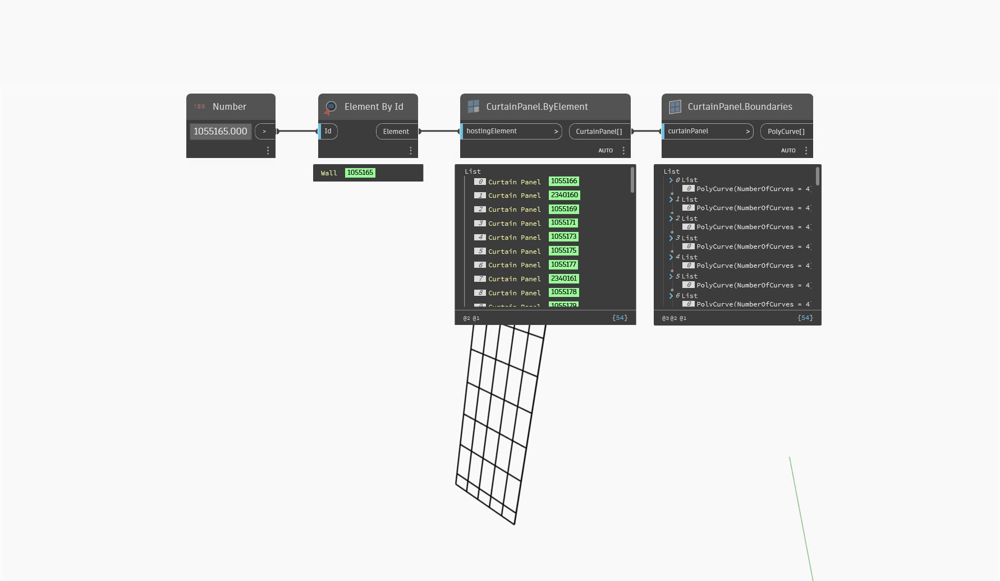

## In Depth
`CurtainPanel.Boundaries` extracts a polycurve representing the given curtain panel's boundaries.

In the example below, a curtain wall element selected by element id, along with all of the curtain panels within the wall element. The boundaries of each curtain panel are then obtained as polycurves.
___
## Example File

