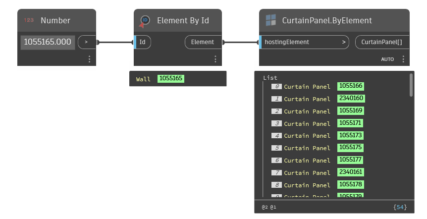

## In Depth
`CurtainPanel.ByElement` obtains all of the curtain panel elements from the input host element. The input element can be a curtain wall, curtain system or sloped glazing roof.

In the example below, all curtain panels are obtained from a curtain wall element selected by element id.
___
## Example File

