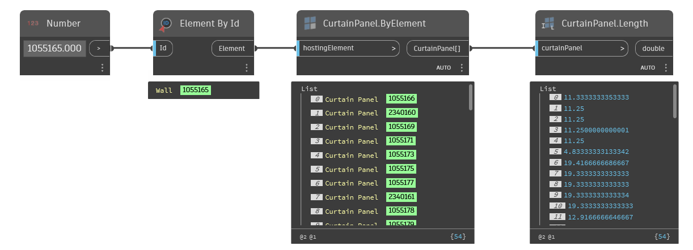

## In Depth
`CurtainPanel.Length` obtains the total length of the curtain panel's boundaries. The returned value is a double in the current project's units.

In the example below, a curtain wall element is selected by element id, along with all the curtain panels within the wall element. The curtain panels' lengths are then obtained as doubles, in project units.
___
## Example File

