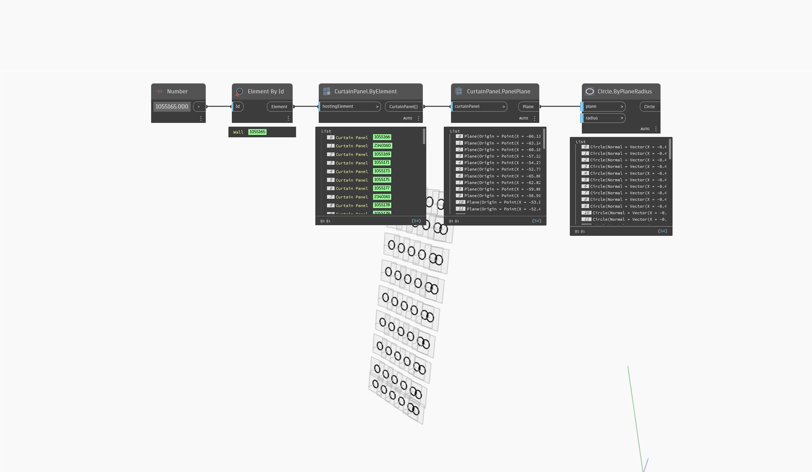

## In Depth
`CurtainPanel.PanelPlane` obtains the underlying plane of the given curtain panel, if it is planar.

In the example below, a curtain wall element is selected by element id, along with all the curtain panels within the wall element. The curtain panels' planes are collected and used to create simple circles.
___
## Example File

