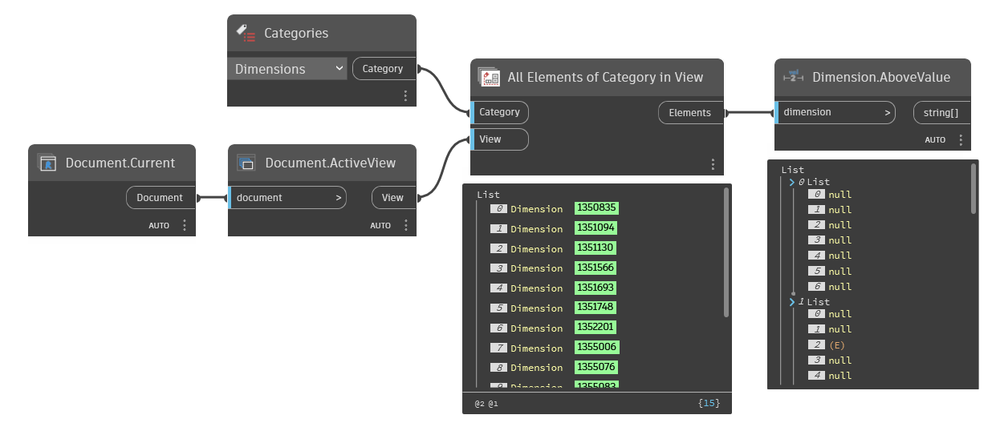

## In Depth
`Dimension.AboveValue` returns the above value of the given dimension, if it has a value. For multi-segment dimensions a nested list of values is returned. If the dimension does not have an above value, null is returned.

In the example below, all dimensions are collected from the active view and their above value is returned.
___
## Example File

