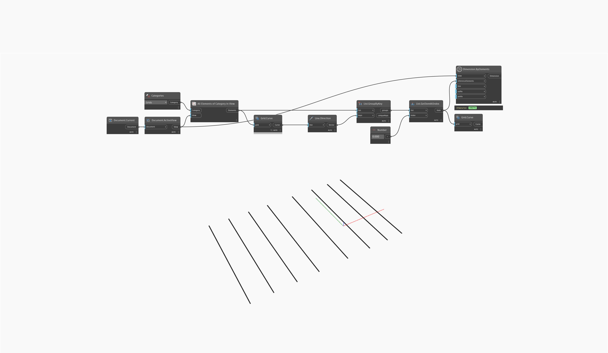

## In Depth
`Dimension.ByElements` allows for the creation of dimensions given a collection of elements. 

In the example below, all grid lines are collected from the active view and grouped by their orientation. The vertical grid lines are obtained and a dimension is generated between them.
___
## Example File

