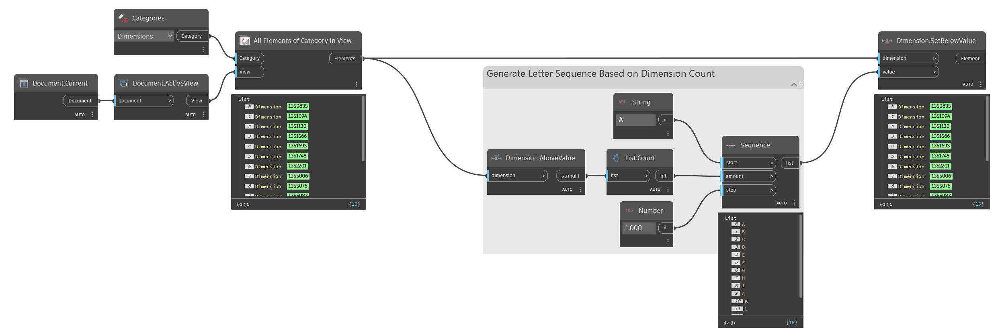

## In Depth
`Dimension.SetBelowValue` sets the below value of the given dimension to the given string. For multi-segment dimensions the same value is set on all segments.

In the example below, the below value is set for all segments on the given dimension.
___
## Example File

