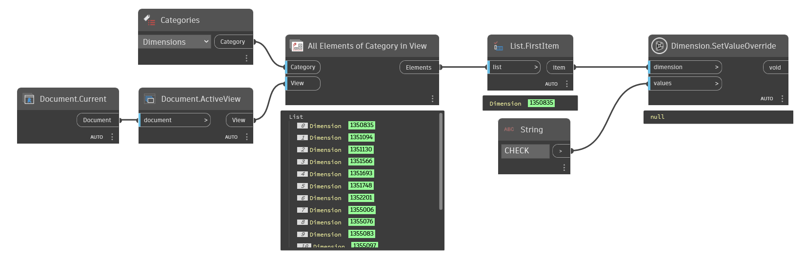

## In Depth
`Dimension.SetValueOverride` will set the overriden value to any input string.

Note, this method uses the Revit API's ability to set values without restrictions and should be used sparingly.

In the example below, the first dimension found in the active view's values are overriden.
___
## Example File

