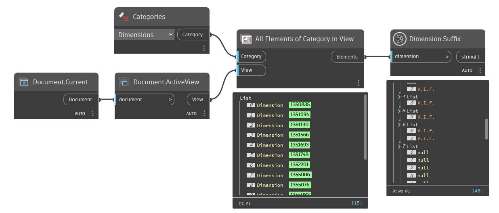

## In Depth
`Dimension.Suffix` returns the suffix of the given dimension, if it has a value. For multi-segment dimensions a nested list of values is returned. If the dimension does not have a suffix, a blank string is returned.

In the example below, all dimensions are collected from the active view and their suffix is returned.
___
## Example File

