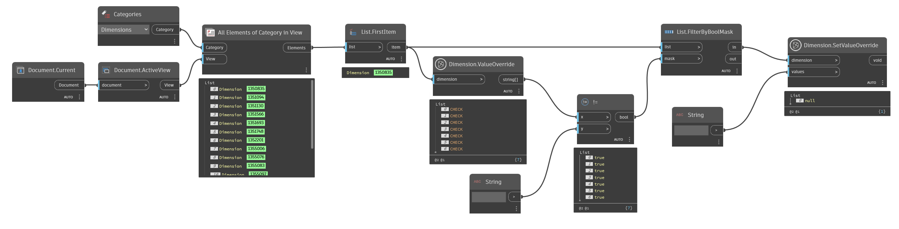

## In Depth
`Dimension.ValueOverride` returns the value override of the given dimension, if it has an overriden value. For multi-segment dimensions a nested list of values is returned. If the dimension does not have an overriden value, a null value is returned.

In the example below, all dimensions are collected from the active view and their overriden value is returned.
___
## Example File

