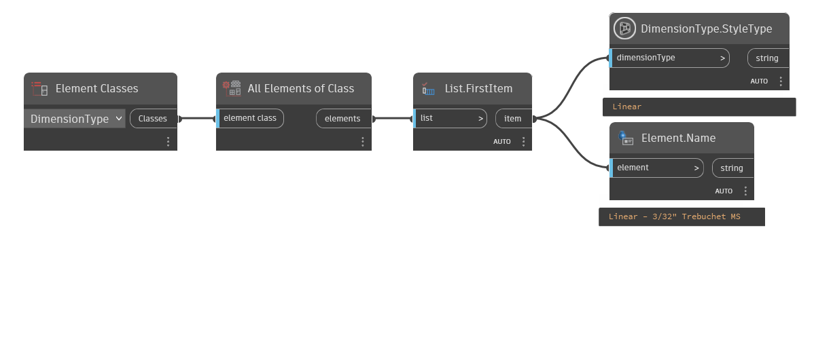

## In Depth
`DimensionType.StyleType' obtains the style for the given dimension style.

Possible dimension style types include:
- Linear
- Angular
- Radial
- ArcLength
- SpotElevation
- SpotCoordinate
- LinearFixed
- SpotSlope
- Diameter
- AlignmentStationLabel

In the example below, the style type is obtained from the first dimension type in the current file.
___
## Example File

