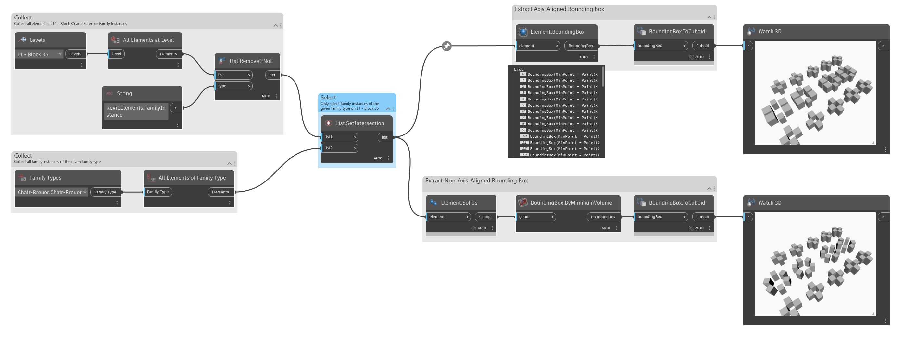

## In Depth
`Element.BoundingBox` extracts a bounding box geometry from the input element. `Element.BoundingBox` provides an axis-aligned bounding box representing an aligned cube along the X-Axis in Dynamo.

In the example below, an axis-aligned bounding box is obtained with `Element.BoundingBox`, and a non-axis-aligned bounding box is obtained by first extracting the family instances' geometry. Non-axis-aligned bounding boxes show a closer representation of the object's orientation.
___
## Example File

