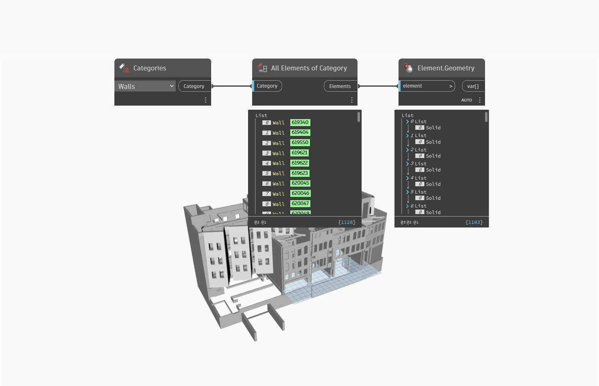

## In Depth
`Element.Geometry` brings the underlying geometry of a Revit element into Dynamo. Geometry includes solids, curves, lines, points and meshes.

In the example below, all the solids for the walls in the current document (file) are generated in Dynamo.
___
## Example File

