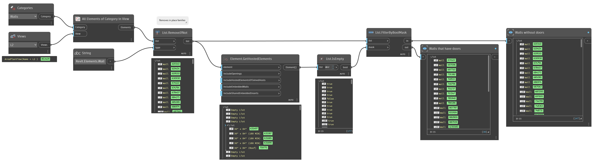

## In Depth
`Element.GetHostedElements` returns the elements that are hosted on a selected element.

In the example below, all openings and embedded walls are returned for the selected wall instances.
___
## Example File

