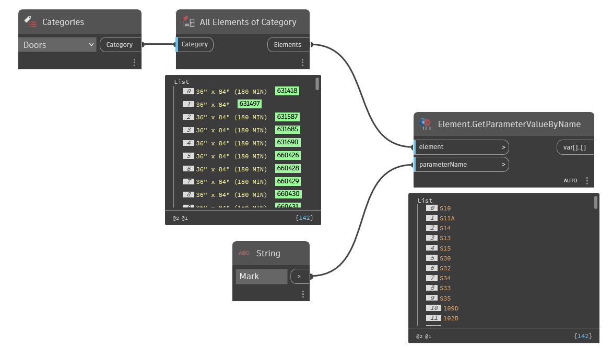

## In Depth
`Element.GetParameterValueByName` returns the value of an element's parameter given the parameter name as a string. Parameter values are returned as strings, doubles, integers, booleans, element ids, and Revit elements.

In the example below, the mark parameter value is collected from all door instances in the current document (file).
___
## Example File

