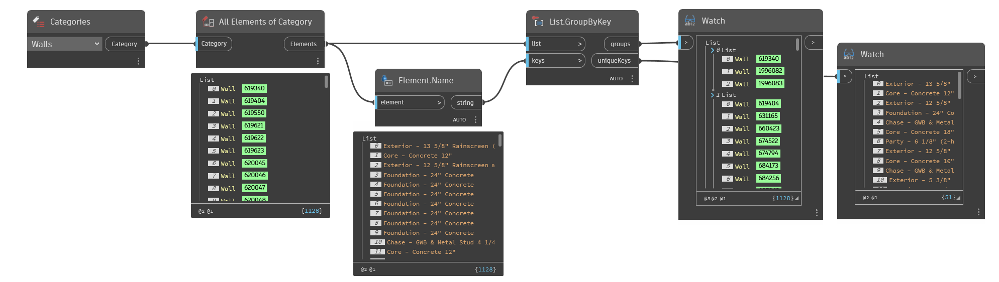

## In Depth
`Element.Name` obtains the user-visible name of the given element. The output string value is the name of the element as it appears in the properties pallette in Revit. 

In the example below, all walls are collected and grouped by their related type name.
___
## Example File

