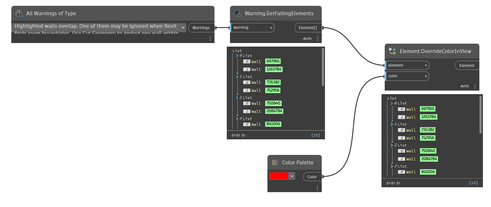
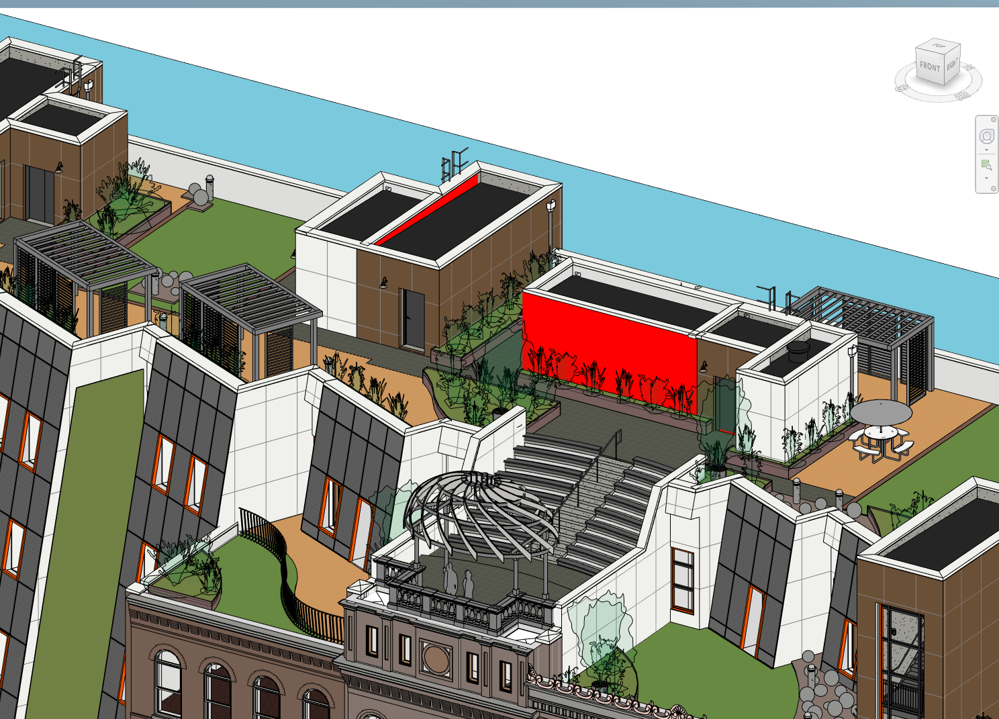

## In Depth
`Element.OverrideColorInView` overrides the surface pattern, cut pattern and line color for the given element with the given color. This node is the equivalent of the right click override options in Revit.

In the example below, wall instances that are overlapping are overridden to the color red. The wall instances are identified by the warnings available in the file.
___
## Example File

