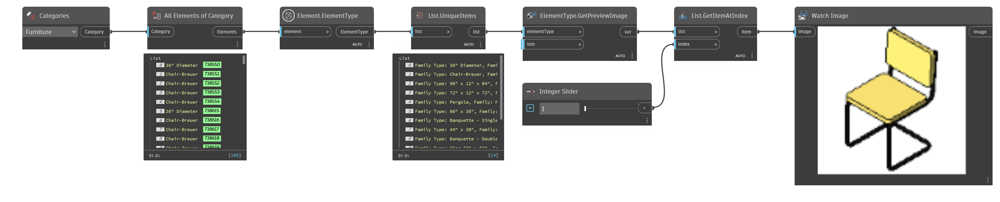

## In Depth
`ElementType.GetPreviewImage` obtains the preview image of the input element.

In the example below, the preview image for each family type of the furniture category is obtained. `Watch Image` can only preview one image at a time, so a `List.GetItemAtIndex` node allows for individual seleciton.
___
## Example File

