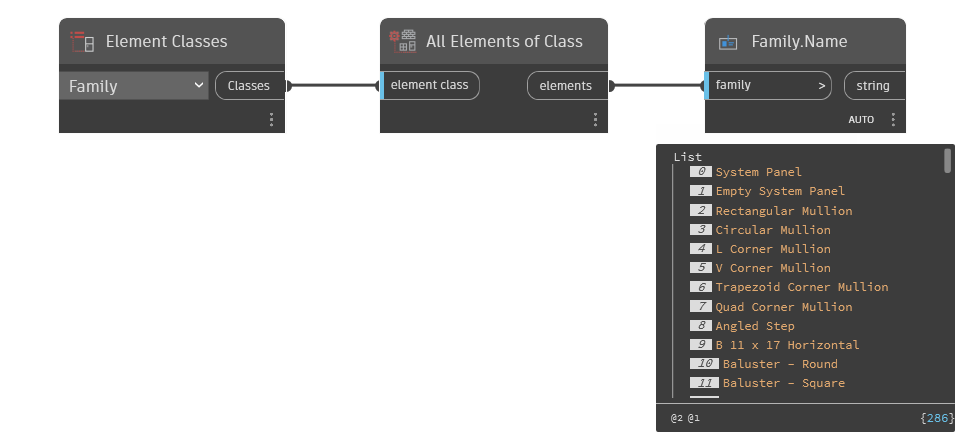

## In Depth
`Family.Name` returns the name of the given family element.

In the example below, all families are collected from the current Revit document. The family names are returned with `Family.Name`.
___
## Example File

