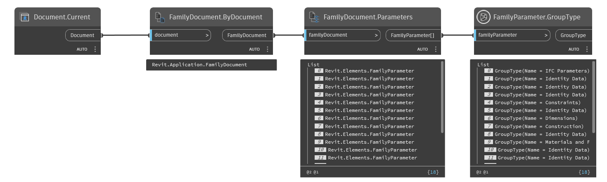

## In Depth
`FamilyParameter.GroupType` reports the group type of a given parameter. A parameter's group type controls where it appears in the property palette in Revit.

In the example below, the current Revit document is converted to a family document and all the parameters are obtained. `FamilyParameter.GroupType` is used to obtain the group type of all the parameters in the family.
___
## Example File

